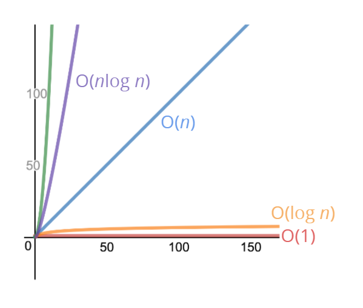

# 빅오 표기법 + 객체와 배열 성능평가
Big O Natation + Object & Array Evaluate

알고리즘 측정방법   
--
### 1. 처리시간 측정 ❌
컴퓨터마다, 실행마다 측정 값 다르다.   
짧은 연산은 측정 시간이 아주 작다는 문제점이 있다.
  
### 2. 처리량 측정 ✅
처리시간 측정을 보완하기 위해 처리량을 측정하는 빅오 표기법을 사용한다.

Big-O 란
--
**알고리즘 분석지표**     
: 처리속도가 어떤지, 얼마나 메모리 사용하는지, 읽기 쉬운지 측정

`시간 복잡도`, `공간 복잡도`로 나뉜다.


측정지표
--
### 시간 복잡도
입력값에 따라 얼마나 많은 연산을 수행하는지 측정    



 - ### O(1) 
    : 상수시간 복잡도   
    실행시간 항상 일정, `math.min(n, 5)`
    ```javascript
    function addUpToSecond(n) {
      return n * (n + 1) / 2;
    }
    ```

- ### O(n)
    : 선형 시간 복잡도    
    1:1 비례하여 실행시간 증가, `math.max(3, n)`
    ```javascript
    function addUpToFirst(n) {
      var total = 0;
      for (var i = 0; i <= n; i++) {
          total += i;
      }
      return total;
    }
    ```

- ### O(n^2)
    : 제곱 시간 복잡도    
    제곱 비례하여 실행시간 증가
    ```javascript
    function printAllPairs(n) {
      for (var i = 0; i < n; i++) {
        for (var j = 0; j < n; j++) {
          console.log(i, j);
        }
      }
    }
    ```

- ### ...

### 공간복잡도
입력값에 따라 알고리즘이 실행되는 동안 필요한 메모리 양

- ### O(1)
    : `Boolean`. `number`, `undefined`, `null`
    
- ### O(n)
    : `length`

- ### ...

복잡도 요령 
--
### 시간복잡도
1. 단일 반복문 : `O(n)`    
2. 중첩반복문 : `O(n²)`    
3. 컬렉션 정렬 : `O(n*log(n))` *버블정렬, 삽입정렬, 선택정렬 ...*

빅오 예제
--
[빅오 함수 실험 사이트](https://rithmschool.github.io/function-timer-demo/)

객체와 배열 성능평가
--
객체와 배열의 시간복잡도
### 객체
```
Object  { key: 'value' }
```
오브젝트 키 `생성` `삭제` `접근` ->> `O(1)`     
`Object.keys()` 처럼 배열을 생성하는 객체 매서드 ->> `O(n)`

### 배열
```
Array   [ "A", "B", "C" ]
```
배열 인덱스 접근 ->> `O(1)`   
배열 앞에 `생성` `삭제` ->> `O(n)` : 배열 인덱스를 전부 수정해야 됨    

배열 관련 매서드는 대부분 `O(n)` // *예외: `push`, `pop`, `sort`*   


참고자료
--
[JavaScript 알고리즘 & 자료구조 마스터클래스 - Colt Steele](https://www.udemy.com/course/best-javascript-data-structures/?couponCode=SKILLS4SALEA)    
[복잡도(Complexity): 시간 복잡도와 공간 복잡도... - hyeojung](https://velog.io/@welloff_jj/Complexity-and-Big-O-notation)