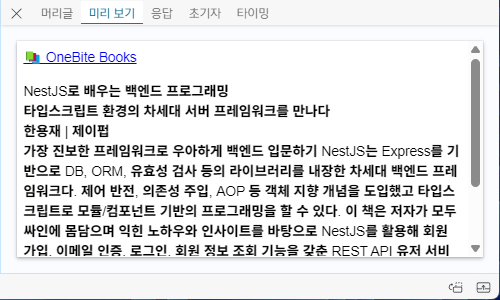
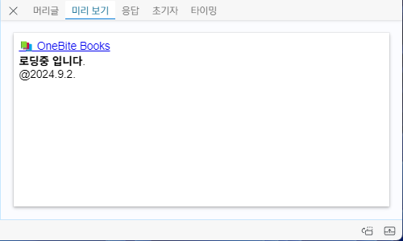

# Next.js

### 목표
: 서버 사이드 렌더링 과정 이해 

### 학습내용
- #### 정리

  <details>
  <summary>Next.js 란</summary>

  React, Next 비교
  --
  ### React   
	**클라이언트 사이드 렌더링**   

  유저 측에서 렌더링 한다. 서버에서 모든 파일을 받아 놓는다. 요청이 오면 브라우저에서 꺼내 쓴다.    

	`FCP` 되는 시간이 느리다. 서버에서 파일을 받고 브라우저에서 렌더링하는 시간이 길다.

  *`FCP`: First contentful paint, 브라우저가 DOM에서 첫번째로 이뤄지는 렌더링*    
  *`DOM`: Document Object Model, HTML/XML 구조의 인터페이스*


  ### Next
	**서버 렌더링**   

	서버에서 렌더링을 시작한다. `HTML` 파일을 먼저 브라우저로 전달하고 수화를 통해 `js` 파일을 브라우저로 전달한다. 초기렌더링 이후로는 클라이언트 사이드 렌더링으로 진행된다.

  `Next FCP` 과정    
  : 서버에서 `HTML` 전달-> 수화: 요청한 페이지의 `JS 번들` 브라우저가 받음 -> 상호작용: 화면 보임(`TTI`) -> 프리패칭: `FCP` 이후 지정한 `js` 파일을 불러옴

  </details>

  <details>
  <summary>Page Router</summary>

  페이지 라우터
  --
  폴더 구조 기반, 페이지 라우팅 제공
	
	### 페이지 생성
  1번 방법 
  ```
  Pages 폴더
    ㄴ (메인 페이지) 실행 파일: index.tsx
    ㄴ (서브 페이지) 실행 파일: "URI 경로명".tsx 
  ```
  2번 방법
  ```
  Pages 폴더
    ㄴ (메인 페이지) 실행 파일: index.tsx
    ㄴ [URI 경로명] 폴더 
      ㄴ (서브 메인 페이지) 실행 파일: index.tsx
      ㄴ (서브 페이지) 동적 경로 실행 파일: [id].tsx 

  ```
  ### 404 처리
  ```
  Pages 폴더
    ㄴ 파일 생성: 404.tsx
  ```

	### 네비게이팅
  페이지 이동, 클라이언트 사이드 렌더링
  
    - `<Link href='주소'>` : 지정한 주소로 이동 

    - `useRouter.push('주소')` : 지정한 주소로 이동

    - `useRouter.back()` : 뒤로가기

    - `useRouter.replace('주소')` : 뒤로가기 방지, 주소 이동

	### 프리패칭
	: 초기화면 렌더링 이후 지정한 `js` 파일을 불러오는 기능,    
  빠른 페이지 이동 목적, 빌드 했을 때만 확인가능

  **프리패칭 설정**
    - 기본값    
    불러온 페이지 이동 링크는 자동으로 프리패칭 됨

    - 사용자 설정   
    `useEffect` 안에 `useRouter().prefetch('주소 입력')` 작성으로 설정 가능

    - 해제    
      `<Link ... prefetch={false}>...</Link>` 

	### API Routes    
	: `api/~` 해당 주소로 이동하면 `ts` | `js` 파일 실행값 반환
  ```
  api 폴더
    ㄴ 파일 생성: ~.ts | ~.js
  ```
	
	### 스타일링
  `app.tsx`에서만 `css` 파일 `import` 가능, 스타일링 겹침 방지

    - 다른 파일에서 `css` 파일 불러오기     
      ```
      1. ~.module.css // 모듈 파일명 사용
      2. import style from './~.module.css' // 스타일 적용 컴포넌트 선언
      3. <div className={style.~}></div> // 점표기법으로 클래스명 부여
      ```
  
  	- 특정부분 레이아웃 방법   
      ```
      1. 특정 레이아웃 파일 생성 // 컴포넌트 폴더
      2. 특정부분이 적용될 컴포넌트 파일에서 컴포넌트 getLayout() 프로퍼티 추가
      3. app.tsx, getLayout() 함수 인자로 컴포넌트 삽입
      ```

  ### Next 사전 렌더링
	페이지마다 렌더링 방식 지정 가능

	#### 1. 서버 사이드 렌더링(SSR)
  요청 들어올 때마다 사전 렌더링 진행 -  *최신 데이터 유지*   
  백엔드 서버(요청,반응)가 느리다면 계속 기다려야함 - *빈 화면*

	#### 2. 정적 사이트 생성(SSG) - 기본값(getStaticProps)
  빌드 타임에 미리 페이지 사전 생성 페이지 생성, 요청 시 렌더링 - *SSR 단점 보완*    
  최신 데이터 반영 어려움, `meta` 데이터 삽입 힘듦 - *컴포넌트 내 비동기 함수 + useEffect 조합*
  - `getStaticPaths(){}`    
  
    - `paths`   
      ```TypeScript
      export const getStaticPaths = () => {
        return {
          paths: [ // 해당 경로 html 파일 미리 생성
            { params: { id: '1' } }, 
            { params: { id: '2' } }
          ], 
        };
      };
      ```

    - `fallback`    
      - false
      
        ```TypeScript
        export const getStaticPaths = () => {
          return {
            fallback: false, 
            // path 외 경로 접근 시 404.tsx 실행
          };
        };
        ```
        

      - blocking    

        ```TypeScript
        export const getStaticPaths = () => {
          return {
            fallback: 'blocking',
            // SSR 방식(빈 화면)
          };
        };
        ```
           

      - true    

        ```TypeScript
        export const getStaticPaths = () => {
          return {
            fallback: true,
            // SSR + 데이터 없는 풀백 상태 페이지 반환
          };
        };
        ```

        

      *`false` 제외하고 로드되는 페이지는 서버에 저장됨, 다시 접속하면 로딩 X*

	#### 3. 증분 정적 재생성(ISR)
    `revalidate` 설정으로 지정한 시간 이후 새로고침 시 데이터 갱신

    ```TypeScript
    export const getStaticProps = async () => {
      ...
      return {
        ...
        revalidate: 5,
      };
    };
    ```
    - On-Demand-ISR   
			: 요청 받을 때마다 `ISR` 작동 설정 가능, `res.revalidate('주소')`
  </details>
