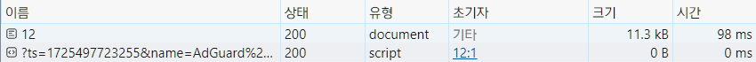

# Next.js

### 목표
: 서버 사이드 렌더링 과정 이해 

### 학습내용
- #### 정리

  <details>
  <summary>Next.js 란</summary>

  React, Next 비교
  --
  ### React   
	**클라이언트 사이드 렌더링**   

  유저 측에서 렌더링 한다. 서버에서 모든 파일을 받아 놓는다. 요청이 오면 브라우저에서 꺼내 쓴다.    

	`FCP` 되는 시간이 느리다. 서버에서 파일을 받고 브라우저에서 렌더링하는 시간이 길다.

  *`FCP`: First contentful paint, 브라우저가 DOM에서 첫번째로 이뤄지는 렌더링*    
  *`DOM`: Document Object Model, HTML/XML 구조의 인터페이스*


  ### Next
	**서버 렌더링**   

	서버에서 렌더링을 시작한다. `HTML` 파일을 먼저 브라우저로 전달하고 수화를 통해 `js` 파일을 브라우저로 전달한다. 초기렌더링 이후로는 클라이언트 사이드 렌더링으로 진행된다.

  `Next FCP` 과정    
  : 서버에서 `HTML` 전달-> 수화: 요청한 페이지의 `JS 번들` 브라우저가 받음 -> 상호작용: 화면 보임(`TTI`) -> 프리패칭: `FCP` 이후 지정한 `js` 파일을 불러옴

  </details>

  <details>
  <summary>Page Router</summary>

  페이지 라우터
  --
  폴더 구조 기반, 페이지 라우팅 제공
	
	### 페이지 생성
  1번 방법 
  ```
  Pages 폴더
    ㄴ (메인 페이지) 실행 파일: index.tsx
    ㄴ (서브 페이지) 실행 파일: "URI 경로명".tsx 
  ```
  2번 방법
  ```
  Pages 폴더
    ㄴ (메인 페이지) 실행 파일: index.tsx
    ㄴ [URI 경로명] 폴더 
      ㄴ (서브 메인 페이지) 실행 파일: index.tsx
      ㄴ (서브 페이지) 동적 경로 실행 파일: [id].tsx 

  ```
  ### 404 처리
  ```
  Pages 폴더
    ㄴ 파일 생성: 404.tsx
  ```

	### 네비게이팅
  페이지 이동, 클라이언트 사이드 렌더링
  
    - `<Link href='주소'>` : 지정한 주소로 이동 

    - `useRouter.push('주소')` : 지정한 주소로 이동

    - `useRouter.back()` : 뒤로가기

    - `useRouter.replace('주소')` : 뒤로가기 방지, 주소 이동

	### 프리패칭
	: 초기화면 렌더링 이후 지정한 `js` 파일을 불러오는 기능,    
  빠른 페이지 이동 목적, 빌드 했을 때만 확인가능

  **프리패칭 설정**
    - 기본값    
    불러온 페이지 이동 링크는 자동으로 프리패칭 됨

    - 사용자 설정   
    `useEffect` 안에 `useRouter().prefetch('주소 입력')` 작성으로 설정 가능

    - 해제    
      `<Link ... prefetch={false}>...</Link>` 

	### API Routes    
	: `api/~` 해당 주소로 이동하면 `ts` | `js` 파일 실행값 반환
  ```
  api 폴더
    ㄴ 파일 생성: ~.ts | ~.js
  ```
	
	### 스타일링
  `app.tsx`에서만 `css` 파일 `import` 가능, 스타일링 겹침 방지

    - 다른 파일에서 `css` 파일 불러오기     
      ```
      1. ~.module.css // 모듈 파일명 사용
      2. import style from './~.module.css' // 스타일 적용 컴포넌트 선언
      3. <div className={style.~}></div> // 점표기법으로 클래스명 부여
      ```
  
  	- 특정부분 레이아웃 방법   
      ```
      1. 특정 레이아웃 파일 생성 // 컴포넌트 폴더
      2. 특정부분이 적용될 컴포넌트 파일에서 컴포넌트 getLayout() 프로퍼티 추가
      3. app.tsx, getLayout() 함수 인자로 컴포넌트 삽입
      ```

  ### Next 사전 렌더링
	페이지마다 렌더링 방식 지정 가능

	#### 1. 서버 사이드 렌더링(SSR)
  요청 들어올 때마다 사전 렌더링 진행 -  *최신 데이터 유지*   
  백엔드 서버(요청,반응)가 느리다면 계속 기다려야함 - *빈 화면*

	#### 2. 정적 사이트 생성(SSG) - 기본값(getStaticProps)
  빌드 타임에 미리 페이지 사전 생성 페이지 생성, 요청 시 렌더링 - *SSR 단점 보완*    
  최신 데이터 반영 어려움, `meta` 데이터 삽입 힘듦 - *컴포넌트 내 비동기 함수 + useEffect 조합*
  - `getStaticPaths(){}`    
  
    - `paths`   
      ```TypeScript
      export const getStaticPaths = () => {
        return {
          paths: [ // 해당 경로 html 파일 미리 생성
            { params: { id: '1' } }, 
            { params: { id: '2' } }
          ], 
        };
      };
      ```

    - `fallback`    
      - false
      
        ```TypeScript
        export const getStaticPaths = () => {
          return {
            fallback: false, 
            // path 외 경로 접근 시 404.tsx 실행
          };
        };
        ```
        

      - blocking    

        ```TypeScript
        export const getStaticPaths = () => {
          return {
            fallback: 'blocking',
            // SSR 방식(빈 화면)
          };
        };
        ```
           

      - true    

        ```TypeScript
        export const getStaticPaths = () => {
          return {
            fallback: true,
            // SSR + 데이터 없는 풀백 상태 페이지 반환
          };
        };
        ```

        

      *`false` 제외하고 로드되는 페이지는 서버에 저장됨, 다시 접속하면 로딩 X*

	#### 3. 증분 정적 재생성(ISR)
    `revalidate` 설정으로 지정한 시간 이후 새로고침 시 데이터 갱신

    ```TypeScript
    export const getStaticProps = async () => {
      ...
      return {
        ...
        revalidate: 5,ㅓ
      };
    };
    ```
    - On-Demand-ISR   
			: 요청 받을 때마다 `ISR` 작동 설정 가능, `res.revalidate('주소')`
  </details>

  <details>
  <summary>App Router</summary>

  앱 라우터
  --
  폴더 구조 기반으로 앱 라우팅 제공   
  `page`, `layout` 파일명은 페이지로, 그외 파일명은 확장자로 인식

	### 페이지 생성
  ```
  app
  ㄴ page.tsx - '/' 메인 페이지
  ㄴ search
      ㄴ page.tsx - '/search' 페이지
  ```
	### Page
  `function Page({params, searchParams}) {}` : 2개 인자로 구성

  *`params`: 동적 라우팅 매개변수 객체 모음*    
  *`searchParams`: 쿼리스트링 변수 객체 모음*

	### Layout
  폴더 내 `layout.tsx` 생성, 동일-하위 파일까지 레이아웃 적용됨

    - 특정 컴포넌트만 `layout` 적용 방법    
  
      라우트 그룹 폴더 `(소괄호 폴더명)` 생성
      ```
      (page-layout) // 라우트 그룹 폴더
        ㄴ layout.tsx
        ㄴ page.tsx
        ㄴ ...
      ```
			
	### Server component     
  앱 라우터의 기본 컴포넌트는 서버 컴포넌트     
  *`console.log()` 터미널에서만 보임*    

  - 리액트 기능을 사용하려면    
    ```
    컴포넌트 상단 'use client' 선언
      ㄴ 왜 지정해야 하는지
        : js 번들 크기 줄임, 클라이언트 컴포넌트만 불러오도록
    ```

  - `client component` 주의사항   
    ```
    1. 서버, 클라이언트(수화과정)에서 각각 실행됨 (2번 실행)
    
    2. 서버 컴포넌트 import X 
        ㄴ 서버가 클라이언트 컴포넌트로 변환됨
        ㄴ 서버 컴포넌트를 클라이언트에게 Props로 넘기면 서버 컴포넌트 유지됨

    3. 서버 컴포넌트에서 직렬화 되지 않은 Props 전달 불가
        ㄴ 예: 함수, 파일핸들, 스레드, 네트워크 소켓 전달 불가
    ```
	
	### Navigating
    `js bundle` : 클라이언트 컴포넌트 전달    
    `RSC payload` : 서버 컴포넌트 전달

	### Page -> App Router 전환
	: `page router` 보다 응답 느려짐, 서버 컴포넌트 `fetch` 응답시간 의심, 백엔드 서버 localhost 연결하면 빠름    

	### Fetch 캐싱
	`cache` : 복사한 데이터 값을 임시 저장하는 공간
	 - `{ cache: 'force-cache' }`   
	 	: 한 번 `fetch` 된 데이터는 캐시에 저장됨, 갱신되지 않음

	 - `{ cache: 'no-cache' }`    
	 	: `fetch` 데이터 캐시에 저장되지 않음, 갱신됨
    
	- `{ next: { revalidate: 5 } }`   
	 	: 5초 동안 캐시 유지, `ISR` 유사

	- `{ next: { tag: ['a'] } }`    
		: 요청 받았을 때까지 캐시유지, `On-Demand-ISR` 유사

	### Request Memoization
	: 한 페이지에서 `fetch` `URI` 동일한지 자동으로 비교, 중복 fetch가 있다면 하나의 `fetch`만 작동

  </details>

  <details>
  <summary>Caching</summary>

  Full Router Cache - 서버
  --
  
  
  페이지 컴포넌트 내 `동적함수` 없고 `캐시`만 사용하는 정적 페이지   
	빌드 하고나서 풀 라우트 캐시에 페이지를 저장함, `SSG` 유사

  *`동적함수`: 쿠키, 헤더, 쿼리스트링*   
  *`캐시`: `fetch()` 두번째 인자 설정*

  - ### 동적 페이지를 정적 페이지로 변환    
    `export function generateStaticParams()`    
      1. 동적페이지를 빌드 할 때 정적 페이지 `HTML` 파일 생성
      2. 페이지 방문 시 서버에 저장, `getStaticPaths()` 유사   

             
             

          (재)실행 할 때 페이지 로드 시간 줄일 수 있음 


  - ### 강제 동적/정적 페이지 설정
    `export const dynamic = "auto";`    
      - `"auto"`: 기본값, 페이지 설정 X     
      - `"force-dynamic"`: 동적 페이지 적용
      - `"force-static"`: 정적 페이지 적용
      - `"error"`: 정적 페이지로 변환 오류 이유 알림

  Client Router Cache - 브라우저    
  --
	중복되는 레이아웃을 브라우저에 저장   
  `Next` 기본 기능    

  </details>

  <details>
  <summary>Streaming</summary>

  스트리밍
  --
	`ux` 개선, 빠른 렌더 우선 렌더링, 동적 페이지여야 자동 적용   
  스켈레톤 UI 적용 유용

	### 페이지 스트리밍
	페이지 자체 로딩 적용
  ```
  1. loading 생성 방법
    : 폴더 내 loading.tsx 파일 생성

  2. 폴더 구조 예시
    app
      ㄴpage.tsx 
      ㄴloading.tsx
  ```

	### 컴포넌트 스트리밍
	컴포넌트 마다 로딩 적용, `<Suspense>` 필요
  ```
  1. loading 생성 방법
    : 로딩 적용할 컴포넌트 <Suspense>로 감싸줌, fallback으로 로딩 컴포넌트 넘겨줌

  2. 컴포넌트 구조 예시
    <Suspense fallback={<loading />}>
      <Allbooks />
    </Suspense>
  ```
  
  </details>

  <details>
  <summary>Error Handling</summary>

  에러 처리
  --
	`error.tsx` 파일로 에러 처리 가능 (하위 파일까지 적용됨)     
	`layout` 파일은 `error` 파일 위치까지 실행됨    
	```
	app
      ㄴ error.tsx
      ㄴ layout.tsx
      ㄴ (search)
          ㄴ page.tsx
          ㄴ layout.tsx
          (ㄴ error.tsx) // 추가해야 search layout 적용됨
	```
	`search`의 레이아웃은 적용되지 않음, `search` 폴더에 `error.tsx` 넣으면 `search` 레이아웃 적용됨

  유용한 리액트 훅
  --
	### `React.startTransition()`
	특정 작업을 낮은 우선순위로 변환하는 함수,     
  함수 내부 비동기 작업도 우선순위에 맞춰 실행됨 - 비동기 작업 우선순위 조정 용이

  ```javascript
  () => {
    startTransition(() => {
      router.refresh(); // 1. Next 서버 데이터 재요청
      reset(); // 2. 리렌더링
    }); 
  }
  // 1 -> 2 순서대로 동작
  // 훅 없으면 2 -> 1, 데이터 업데이트 안 됨
  ```

  </details>
  <details>
  <summary>Server Action</summary>

  `"use server"`    
  --
	클라이언트가 아닌 서버에서 동작하도록 선언, `"use client"` 기능 유사
	
	```TypeScript
	async function createReview(formData: FormData) {
		'use server'; // 서버에서 작동
	}
	```
	```TypeScript
	export function BookReviewForm() {
		return (
			<form action={createReview}>
			... // form 제출 데이터 서버(createReview)로 전달
			</form>
		);
	}
	```

  Incremental Static Regeneration
  --
  증분 정적 재생   
  페이지 재검사, 데이터 갱신, 풀 라우트 캐시 `purge`- 초기화

  ### `revalidatePath()`
  지정한 주소로 재검사, 전체 캐시 지워지고 새로운 데이터 가져옴   
    - `router.refresh()` 차이점   

      : `server`가 아닌 `client-api`, 캐시 무효화 X, 데이터 갱신 X
  
  ```TypeScript
  revalidatePath(`/book/${bookId}`);
  ```

	### `revalidateTag()`
  `fetch` 인자 선언, 개별 지정 가능, 태그 실행 시 해당 캐시 재검사

  ```TypeScript
  const response = await fetch(..., {
    next: { tags: [`review-${bookId}`] },
  });
  
  revalidateTag(`review-${bookId}`); // response 실행되면 Tag 실행
  ```

  유용한 리액트 훅
  --
  ###	`React.useActionState()`
  *2024년 v19 적용*   

	`Form` 액션 결과 상태 추적 함수 - 연속 제출 방지, 에러 처리 용이    
	```TypeScript
	const [state, formAction, isPending] = useActionState(createReview, null);
	```
	`state`: 폼 액션 함수 반환 값 >> `object`   

	`formAction`: 폼 액션 자체 함수 >> `function`    

	`isPending`: 폼 액션 실행 여부 >> `boolean`   
  </details>

  <details>
  <summary>Parallel Routes</summary>

  병렬 라우트
  --
  조건부 또는 동시에 여러 페이지를 한 레이아웃에서 렌더링 할 수 있다.     

  대쉬보드나 피드, 모달 같은 동적 섹션에 적합하다.
  병렬로 렌더링 된다.

  - 폴더 구조

      ```
      app
        ㄴ @user
            ㄴ page.tsx
            ㄴ info
                ㄴ page.tsx
        ㄴ @team
            ㄴ page.tsx
        ㄴ page.tsx
        ㄴ layout.tsx
      ```
      부모 `layout`에서 `slots`을 인자로 받을 수 있다. `slots`은 `@` 시작하는 폴더명들이다.

      `/@user/info` 가 아닌 `/info` 주소로 접근할 수 있다. 그러나 직접 경로로 접근하면 `404` 페이지로 이동한다. `layout`에서 페이지를 생성하는 과정을 생략하기 때문이다.    
      
      `@team`, `app` 폴더에 `default` 페이지를 만들어 두면 이미 생성한 `default` 화면을 보여줌으로써 접근 가능하다. `default` 페이지를 생성해야 원활하게 작동하는 경우가 있다. 

  - 개선된 폴더 구조
      ```
      app
        ㄴ @user
            ㄴ page.tsx
            ㄴ info
                ㄴ page.tsx
        ㄴ @team
            ㄴ page.tsx
            ㄴ default.tsx
        ㄴ page.tsx
        ㄴ layout.tsx
        ㄴ default.tsx
      ```
  </details>

  <details>
  <summary>Intercepting Routing</summary>

  라우트 가로채기
  --
  초기접속이 아닐 때(`Link`, `Push`, `Route` 이동 시) 다른 페이지 컴포넌트로 렌더링 된다.   

  폴더 구조로 `modal` 페이지를 구현할 수 있다. 새로고침(초기접속) 하면 원래 페이지 컴포넌트로 렌더링 된다.  

  ### 폴더 구조
  ```
  app
    ㄴ (.)book/[id]
          ㄴ page.tsx
    ㄴ book/[id]
          ㄴ page.tsx
  ```
  동일한 폴더명 앞에 선언한 폴더 위치 기준으로 `(.)` 붙이면 가로챌 페이지 폴더를 지정할 수 있다.    

  ### 폴더 위치에 따른 명명   
  ```  
  가로챌 페이지 폴더가 

  (.): 동위 폴더에 있다면
  (..): 상위 폴더에 있다면
  (..)(..): 2단계 상위 폴더 위치
  (...): 루트 폴더에 있다면
  ```  
  </details>

  <details>
  <summary>Image optimization</summary>
  
  `` 최적화
  --
  `Next`에서 제공하는 `Image` 컴포넌트로 이미지를 최적화 할 수 있다.    

  `src`, `width`, `height를` 설정해주어야 한다. (`width`, `height` 없다면 `fill` 설정)    

  ### Remote Image    

  외부에서 이미지를 가져온다면 `next.config.mjs`에서 `remotePatterns`을 설정해야 한다.
  ```
  const nextConfig = {
    images: {
      remotePatterns: [
        {
          hostname: 'shopping-phinf.pstatic.net',
        },
      ],
    },
  };
  ```
  </details>

  <details>
  <summary>Metadata</summary>

  메타데이터 생성
  --
	`Next`에서 `Metadata` 인터페이스를 지원한다. 서버 컴포넌트에서만 사용할 수 있다. `layout` 또는 `page`에서 객체/함수를 내보내면 된다.

	### `The object`
	정적 메타데이터를 정의
	```
	export const metadata: Metadata = {
		title: '...',
		description: '...',
	}
	```

	### `generateMetadata()`
	동적 메타데이터를 정의, 파라미터로 `props`를 받을 수 있다.
	```
	export async function generateMetadata({ params }) {
		return {
			title: '...',
		}
	}		
	```

	*`props`: `params`, `searchParams`*
  </details>

## 에러해결
### 1. 'key' is specified more than once, so this usage will be overwritten.
`컴포넌트 key`와 `타입 key` 충돌, 타입 안에 `key` 라는 `타입명` 있다면 오류 발생 

### 2. Type error: Type 'OmitWithTag<typeof ...>' does not satisfy the constraint '{ [x: string]: never; }'.
한 컴포넌트 안에 여러 개의 컴포넌트가 존재할 수 있다. `App Router`에서 `export`는 `하나의 컴포넌트만` 할 수 있다. `Page Router`는 `export` 다중 선언 가능하다.

*개발자 모드일 때는 작동하지만 npm run build 할 때 오류 발생한다.*

```TypeScript
// page.tsx - App Router

export const Content = () => { // Error, build 오류 - export 제거
  return <p>This is the content</p>;
};

export default function Page() {
  return <Content />;
}
```

### 3. Warning: async/await is not yet supported in Client Components, only Server Components.
`'use client'` 선언한 컴포넌트가 `'use server'` 선언한 컴포넌트를 포함하면 빌드할 때 오류가 발생한다. 반대는 가능하다.

```
X
<Page />
ㄴ <BookReviewForm />     'use client'
    ㄴ <BookReviewList /> 'use server'

O
<Page />
ㄴ <BookReviewForm /> 'use client'
ㄴ <BookReviewList /> 'use server'
```

### 4. Skipping auto-scroll behavior
`position: sticky` 또는 `position: fixed` 스타일이 적용된 요소에서 자동 스크롤 동작이 생략되었기 때문에 발생한다. 해당 태그를 `scroll={false}` 하면 오류가 해결 된다고 하지만
그렇지 않았다.    

오히려 문제였던 태그를 `div`로 감싸주면 자동 스크롤이 설정돼서 해결되었다. `stack Overflow`는 신이다.

### 5. If you use CSS to change the size of your image, also include the styles 'width: "auto"' or 'height: "auto"' to maintain the aspect ratio.
`css` 설정이 아닌 `Next`가 제공하는 `<Image />` 컴포넌트에서 내장 스타일 `width`, `height`를 `auto`로 지정하면 해결된다. 다만 이미지를 불러온 이후에 크기가 무너지는 경우가 있다.
