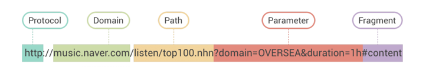

# How the web works

## 의문점

socket.io-client를 사용하면서 웹은 어떻게 동작하는지 궁금

## 참고자료

[웹(WWW)의 동작 원리 - all-young](https://all-young.tistory.com/21)  
[반드시 알고 넘어가야 할 웹 기술 기초편 - 크리핵티브(인프런)](https://www.geeksforgeeks.org/what-is-callback-hell-in-node-js/)  
[How the web works - mozilla](https://developer.mozilla.org/ko/docs/Learn/Getting_started_with_the_web/How_the_Web_works#%EB%8F%84%EA%B5%AC_%EC%83%81%EC%9E%90%EC%9D%98_%EB%8B%A4%EB%A5%B8_%EB%B6%80%EB%B6%84%EB%93%A4)

## 정리내용

   

### 1. 웹 구성요소  
     HTML, HTTP, URL

  - HTML    
    : 서버가 클라이언트에 응답으로 보내는 파일    
  
  - HTTP
    : 웹 서버와 웹 클라이언트 간 통신 관리 프로토콜   

    > *프로토콜: 원거리 통신 장비 사이에서 메시지를 주고 받는 통신규약*
  
  - URL   
    : 웹 클라이언트가 웹 서버로 요청할 자원의 주소   

       
    - 구성요소: `프로토콜`, `호스트`, `포트`, `패스`, `쿼리스트링`
     
### 2. 웹 동작원리   
  

     

  1. 클라이언트 요청 
  2.  웹 서버 수신 
  3.  웹 어플리케이션 서버 처리 
  4.  ( DB 요청/응답 ) 
  5.  웹 어플리케이션 서버 응답 생성 
  6.  웹 서버 응답 
  7.  클라이언트 응답 수신/표시
  

## 결론

 
웹 클라이언트의 요청이 있어야 웹 서버의 응답이 있다.

