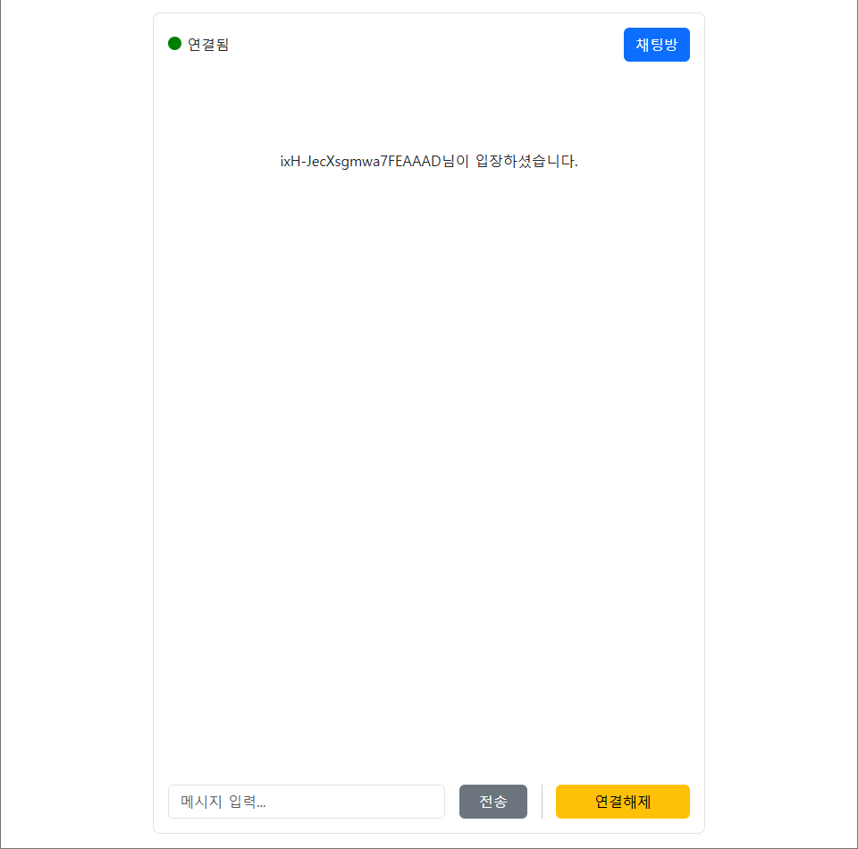
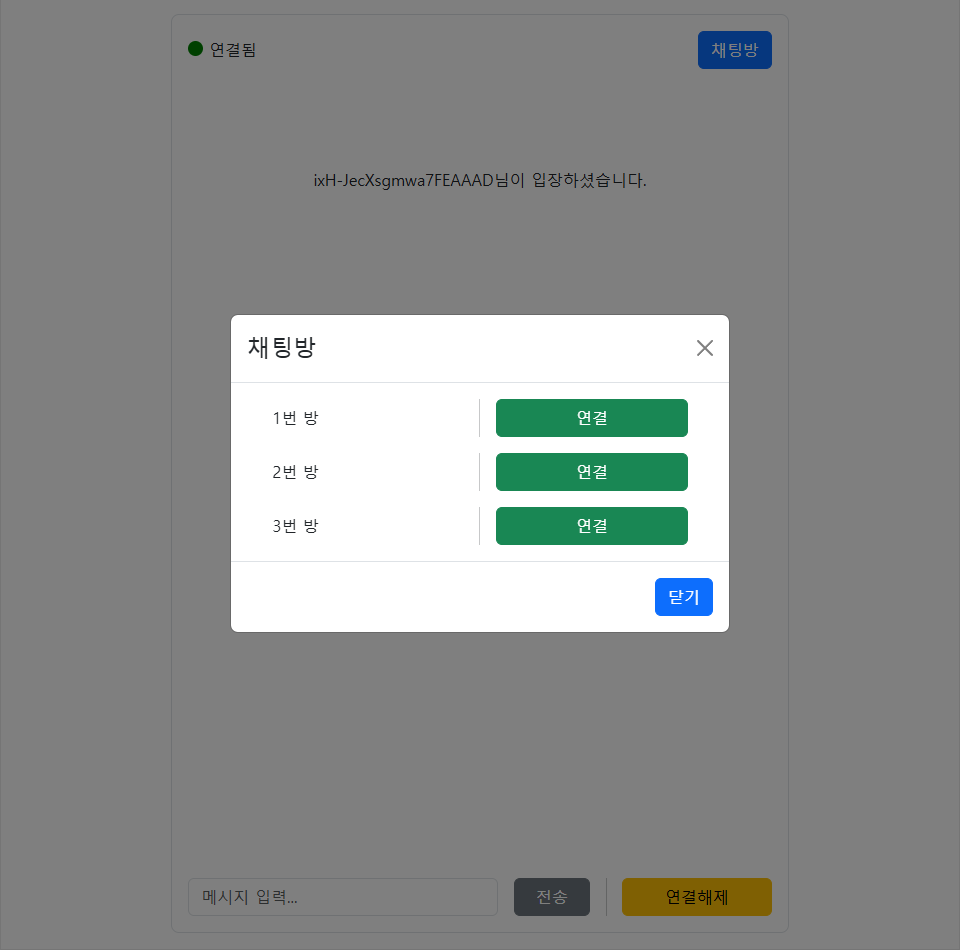
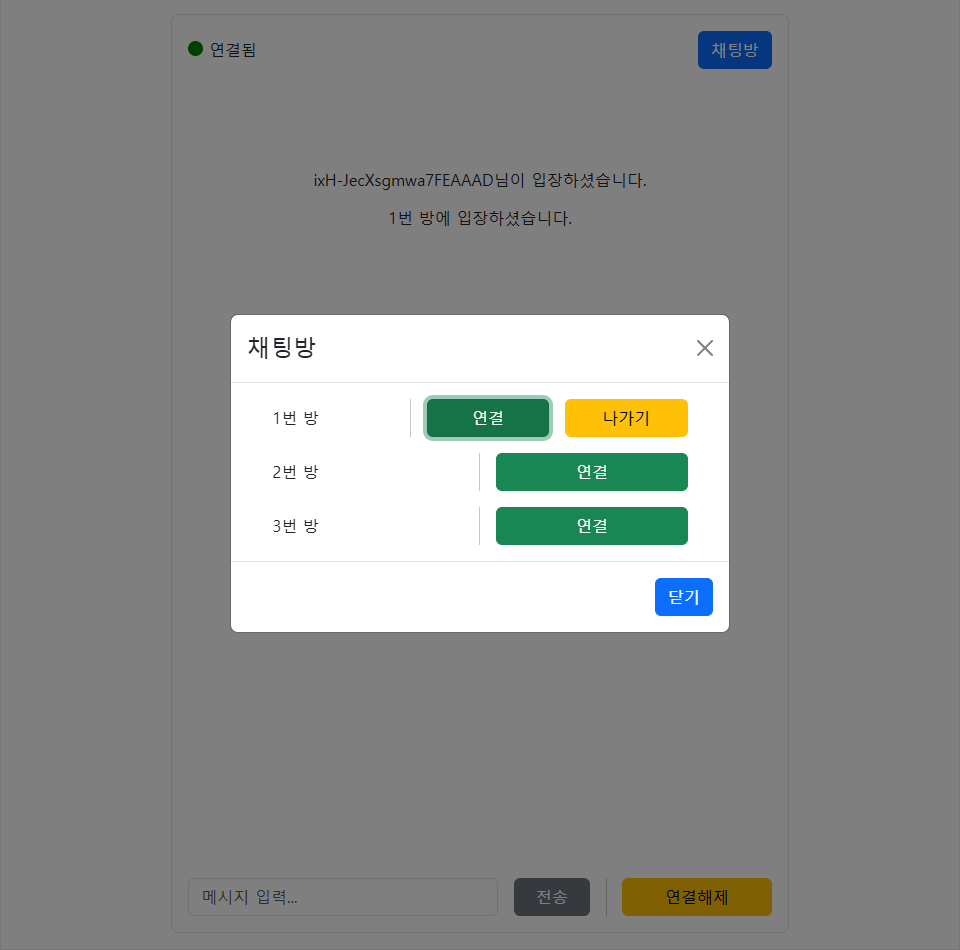
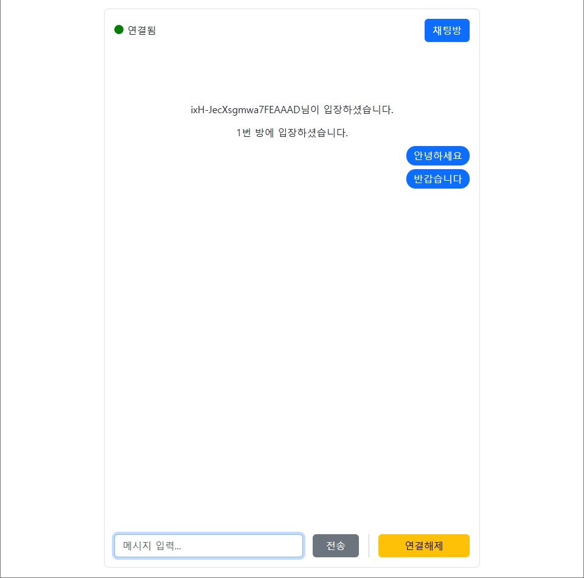
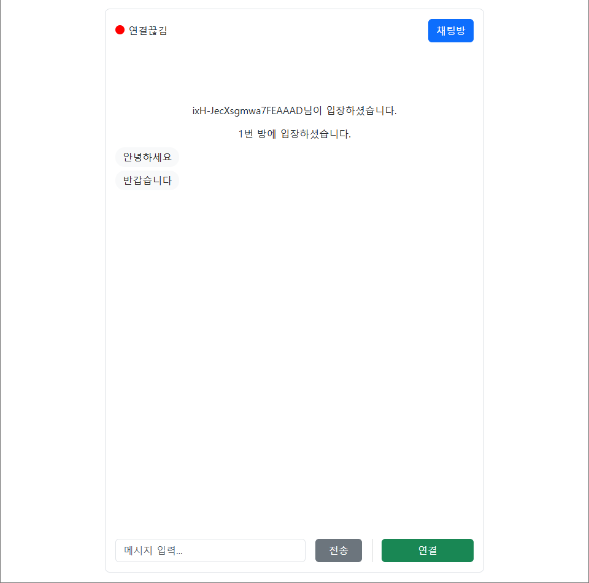
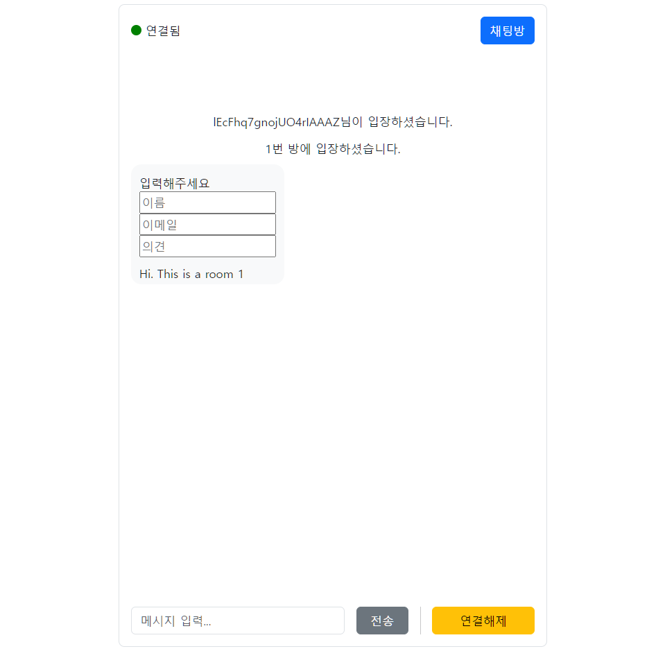

# Socket.IO 채팅창 📬

Socket.io-client를 활용하여 React로, 서버는 Express 구현, 레이아웃은 Bootstrap 사용

## 📷 구현 스크린샷
### 채팅방 입장
     

### 서브 채팅방 입장 상태
    
    

### 메시지 전송
    

### 채팅방 나가기 
    

### 챗봇 - formData 가공 
    


## 📜 문제해결
  - ### 서버-클라이언트 연결    
    : 서버와 클라이언트 소켓 `connect`만 구현하고 확인함. `socket.connected`가 계속 `false`였음. 개발자 창을 통해 연결을 확인해봄. `'... by CORS'` 경고 떠서 `cors` 초기 설정으로 `localhost:3000`, `localhost:5173` 호스트를 연결함. 여기까지 금방 해결했지만 `localhost:3000 /socket.io (not Found) 404` 에러가 생김. 무엇이 문제인지 몰랐음. 현재 구현한 개발자창 응용프로그램 연결된 파일하고 전에 실습한 서버와 연결된 파일을 비교해봄. 문제는 없었음. 구글링을 해봐도 대부분 `cros` 문제 해결을 알려주고 있어서 해결하기 어려웠음.     

    다시 천천히 로그를 봄. `localhost:3000` 에러는 서버쪽 문제여서 서버 파일을 다시 봄. 자세히 보니 `app.listen(3000)`가 문제였음.   
    
    
    ```javascript
    const app = express();
    const server = createServer(app);

    app.listen(3000);
    ```

    `app`이 아닌 `server` 변수로 서버를 열어야 하는데 반대로 하고 있었음.    
    
    둘의 차이점은 `app`은 `클라이언트 요청의 로직`을 처리하고 `server`는 `app`이 처리한 내용을 보여줌. `server.listen(3000)`으로 간단하게 서버-클라이언트 연결 문제 해결. 참 어이없는 실수였음.
         
  - ### 내가 보낸 메시지    
    : 서버로 클라이언트를 구현하면 다중 창으로 여러 명의 역할을 할 수 있지만 클라이언트의 주소가 정해져 있어서 1명의 아이디만 사용가능했음.   

    내가 보낸 메시지를 알기 위해 서버로 메시지를 보낼 때 현재 작성한 사람의 `id`도 같이 보냄. 다시 되돌려받을 때, `Event.jsx`에서 현재 클라이언트 `socket.id`와 메시지 `id`를 비교함. 결과에 따라 클래스명 달리 부여하고 `css`로 꾸밈  

  - ### 서브 채팅방 입장 상태   
    : 내가 보낸 메시지를 알려면 `socket.adaptor`의 정보를 알아야 했음. 클라이언트가 아닌 서버 `socket`이 필요했음. (클라이언트에는 `sids`, `rooms` 정보 없음)     

    서버 폴더 `index.js`에서 `join`, `leave` 이벤트 마지막에 코드 한줄 추가. 
    ```javascript 
    io.emit(`user`, { id: 'io', sids: sidsArr }); 
    // sids : 접속한 아이디 목록(현재 접속한 방 보여줌)
    ```   
    비주얼스튜디오 콘솔에서는 잘 나왔지만 웹 콘솔에서는 빈 값이 출력됨. 알고보니 `set` 값은 전달되지 않는 `json` 형태였음. `set`을 배열 형태로 변환하여 전달.   

    `useContext`로 받아오고 현재 클라이언트 `socket.id`로 `sids` 배열에 해당 아이디의 방 배열을 확인으로 상태 구현  

  - ### 챗봇 - formData 전송
    : 서버는 `emit`으로 클라이언트에게 데이터를 전송한다. 클라이언트는 `onFooEvent` 함수로 서버가 보낸 데이터를 받는다.     
    
    클라이언트가 특정 방에 접속했을 때 서버는 `formData`를 전송한다. 클라이언트 는 `formData`를 받으면 `<FormData />` 컴포넌트를 생성한다. 입력된 상태값으로 서버로 전달할 수 있다.

### 에러 기록
  - ### vercel - Websocket 구현 어려움
  
    [Do Vercel Serverless Functions support WebSocket connections?](https://vercel.com/guides/do-vercel-serverless-functions-support-websocket-connections)