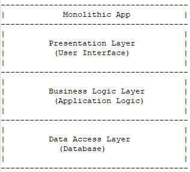
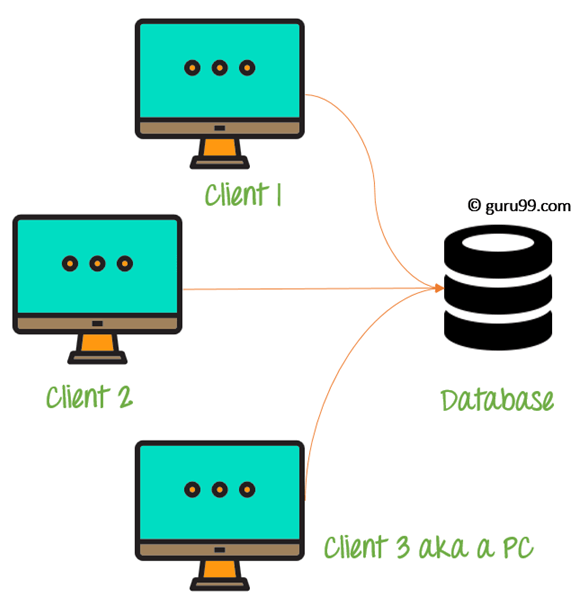
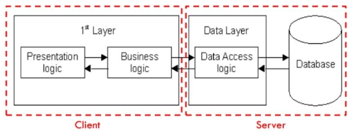
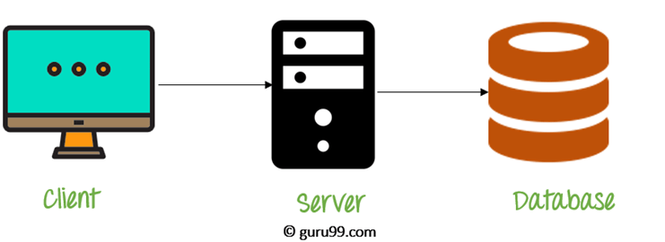
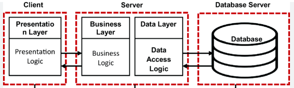
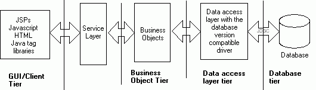

# 내게 필요한 서버 구조 : 네트워크 구조
Architecture Of Client And Server

서버에 `API key`를 맡기지 않고 `API` 요청 자체를 맡기면 되지 않나란 궁금증이 생겼다. 

```
작동과정

1. 클라이언트 접속
2. 클라이언트는 데이터서버에 데이터 요청
2. 데이터서버는 요청 uri, cors 확인하고 API 요청.
3. API 응답 오면 데이터서버는 클라이언트에게 API 응답 전달
4. 클라이언트는 응답 수신
```
`Copilot`한테 구현 가능 여부를 물어봤다. `클라이언트-서버 아키텍쳐` 관련 내용이라는 걸 알게 됐고 더 자세한 내용을 알기 위해 찾아봤다.

## 네트워크 구조

### **1 - Tier (Monolithic Architecture)**
<details>
  <summary>예시 사진</summary>
      
      
</details>

클라이언트와 서버, 데이터베이스가 한 곳에 있는 1계층 구조    
: 소규모 애플리케이션에 사용됨


### **2 - Tier (Client-Server Architecture)**
<details>
  <summary>예시 사진</summary>
      
      
</details>

클라이언트와 서버 2계층으로 구성된 구조   
: 클라이언트의 요청, 서버의 응답으로 작동

### **3 - Tier**
<details>
  <summary>예시 사진</summary>
      
      
</details>

클라이언트, 서버, 데이터베이스 3계층으로 구성된 구조   
: 데이터베이스 서버가 둘로 나뉘어 확장성, 유지성 향상

### **N - Tier**
<details>
  <summary>예시 사진</summary>
      
</details>

`3-Tier`에서 계층이 추가된 구조    
: 보다 더 확장 가능하고 유연하지만 복잡한 구조


## 클라이언트/서버 모델   
        
   

**DNS 서버** : 클라이언트 측에서 요청하면 `WEB 서버`의 `IP 주소`를 전달    

**WEB 서버** : 클라이언트에게 요청 받은 `HTTP` 응답 전송   
  

## 클라이언트/서버 모델 장단점
### 장점
: 중앙집중 방식, 유지보수 비용 절감, 데이터 복구 가능 

### 단점
: 데이터 이동할 때 서버 바이러스 감염 위험, 데이터 유출 가능  

## 결론
```
- 클라이언트/서버 구조로 API 중계 겸 데이터베이스 서버로 개설. 
- IP 블랙리스트 파일을 만들어서 서버 보관
```

## 참고자료
### 블로그
[클라이언트-서버 아키텍처의 이해와 웹 개발에서의 적용 - Flab](https://f-lab.kr/insight/understanding-client-server-architecture)    
[클라이언트 서버 아키텍처 ( 서버 / 클라이언트 / DB) - YS_Study.log](https://velog.io/@estell/%ED%81%B4%EB%9D%BC%EC%9D%B4%EC%96%B8%ED%8A%B8-%EC%84%9C%EB%B2%84-%EC%95%84%ED%82%A4%ED%85%8D%EC%B2%98)    
[네트워크/ 1-Tier, 2-Tier, 3-Tier Architecture - 아롬롬](https://romcanrom.tistory.com/75)    
[client-server-model - geeksforgeeks](https://www.geeksforgeeks.org/client-server-model/)    
[Web application architecture types - Sivakumar Mani](https://medium.com/@sivakumarjd/web-application-architecture-types-single-tier-architecture-monolithic-architecture-two-tier-f3d5c9f2aff6)    
[What Are the Main Types of Web Application Architecture? -  Mashia Aftab](https://hapy.co/journal/web-application-architecture/)    