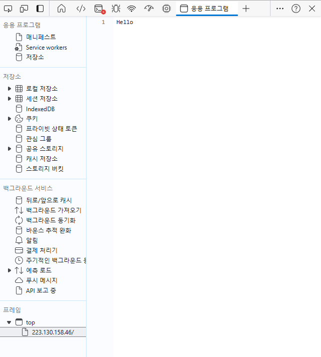

# 데이터서버 출력 여정기 1
Data Server Console log - Journey Chapter 1

## 1. 서버 페이지 리소스 드러나나?
처음 데이터서버를 구축한다고 계획했을 때 클라이언트 페이지처럼 생각했다. 클라이언트 리소스 파일에서 서버 주소를 알 수 있다. 그러면 서버 주소로 접속하면 그 페이지에서 리소스 파일이 유출되는게 고민이었다. 한번 시험해봤다. `hi.js` 파일을 가져오는 `hello.js` 서버 파일을 실행했다.

   

예상과 다르게 리소스 파일이 드러나지 않았다. 신기했다. 출력된 형식이 `문자열`이거나 `HTML`일 경우만 리소스 파일로 보였다. 다행이었다. `js` 파일이 뜨면 미들웨어 순서를 바꿔서 가져오는 데이터를 나중에 가져오게 할지 이상한 해결책을 생각했다. 서버 공격 방법은 있겠지만 지금으로써는 리소스만 안 보여도 좋다.  

## 2. 서버로 요청을 어떻게 해?
말만 서버지 `공인IP`로 된 페이지다. 지금까지 `API`로 데이터를 가져왔는데 `API` 설정하지 않은 데이터를 가져오기란 상상도 못할 행동이었다.

여러 블로그 글을 찾다가 `http`로 요청을 보내면 된다고 해서 한 번 따라해봤다.    

```javascript
const options = {
  hostname: HOST, // 공인IP 주소
  port: 3000,
  path: '/',
  method: 'GET'
};

const req = http.request(options, (res) => {
  let data = '';

  res.on('data', (chunk) => {
    data += chunk;
  });

  res.on('end', () => {
    console.log(data);
  });
});

req.on('error', (e) => {
  console.error(`Problem with request: ${e.message}`);
});

req.end();
```
이게 되네? 콘솔로그에 `"Hello"`가 출력됐다. 서버에서 보여지고 있는 문자열을 가져왔다. 혹시나 하는 생각에 `fetch`, `axios`로 변환해봤다.
```javascript
// fetch
const url = `http://${HOST}:3000/`

fetch(url)
  .then(res => {
    return res.text()
  })
  .then(res => {
    console.log(res) // "Hello"
  })
  .catch(err => {
    console.error('에러', err);
  })
```
```javascript
// axios
const config = {
  proxy: {
    protocol: 'http',
    host: HOST,
    port: 3000,
  },
}

axios.get('/', config)
  .then(res => {
    console.log(res.data) // "Hello"
  })
  .catch(err => {
    console.error('에러', err);
  })
```
아주 잘 된다. 요청 받으면 `json` 형태 데이터를 응답으로 보내줘야겠다.

## 3. 접속 URI 어떻게 알아내지?
`공인IP` 직접 접근을 막기 위해 요청이 시작된 `URI`을 받고싶었다. `request`에 모든 정보가 있다고 생각했다. `console.log(request)`를 출력해봤다.     

` TypeError: Converting circular structure to JSON`   

순환참조 오류가 계속 생겼다. 이걸 해결하기 위해서 찾아보고 실행해보고 다 해봤다. 결국 `flatted` 패키지로 해결되는 간단한 문제였다.    

출력하고 보니 값들이 세하다. 원래 보던 `key-value` 형태가 아니다. 문자열로 출력했다 해도 `key` 없이 `value`만 있는 것들도 있었다. 그래서 `request`가 어떤 프로퍼티를 가지고 있는지 `express` 공식문서로 가봤다.    

`request`는 수 많은 프로퍼티, 매서드를 가지고 있었다. 내가 원하는 프로퍼티가 적혀 있었다. 점 표현식으로 출력해봤다. 출력된다. 왜 계속 이상하게 빙빙 돌고 있었을까. 
```javascript
app.get('/', function (req, res) {
  res.send(req); // 전
  res.send(req.hostname); // 후
})
```
원래 접속한 클라이언트 URI를 가져와야 하는데 서버주소인 `공인IP`를 가져온다. 아직까지 어떻게 가져오는지 잘 모르겠다. 더 해봐야 알 것 같다.

<p align="center">
  ----------------------------------------------------<br>   
  해볼 것 : 접속한 URI 출력해보기<br>   
  ----------------------------------------------------   
</p>

## 참고자료
[기본 예제 - axios](https://axios-http.com/kr/docs/example)   
[api - express](https://expressjs.com/ko/api.html#req.hostname)   
[fs - Node.js Doc](https://nodejs.org/docs/latest/api/fs.html)   