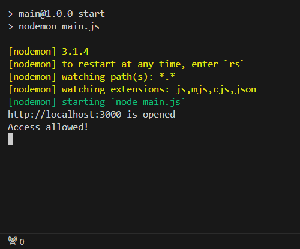
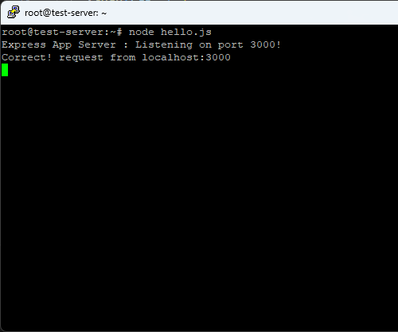
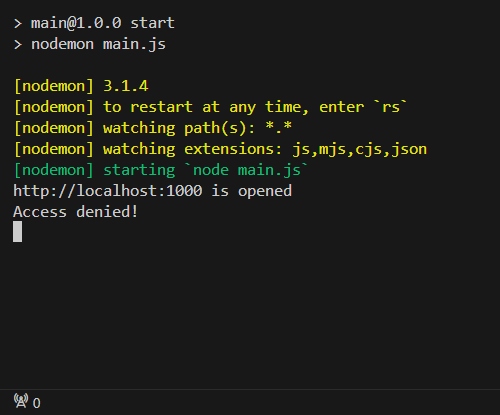
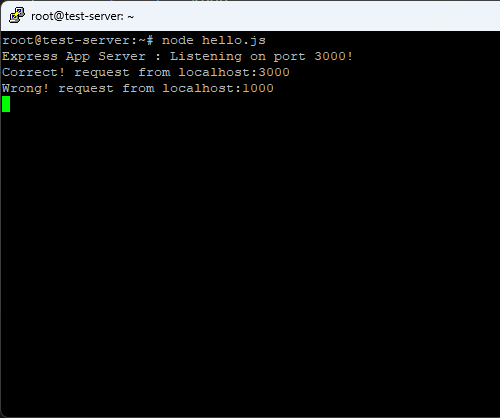

# 데이터서버 출력 여정기 2
Data Server Console log - Journey Chapter 2

경로 접근을 제한하기 위한 첫 아이디어는 `CORS`이었다. `CORS` 패키지를 설치하고 서버에서 `origin`을 설정했는데 여전히 값을 전달했다. 설정이 잘 안되었는지 `access-control-allow-origin`을 직접 설정해봤다. 전과 같은 결과였다. 경로를 제한하지 못했다.   

다른 방법을 찾아봤다. `method: POST`는 `body`를 사용할 수 있지만 `method: GET`은 헤더에 내용을 심어야 했다.

*`GET`은 `body` 사용 불가*    
*`PuTTY`에서 헤더는 `camelCase`로 표기되지 않는다*

## 1. 헤더 추출
### Request
어떻게 헤더를 추출할까? `console.log(req)`로 출력해봤다.
```
{
  ...
  [Symbol(kHeaders)]: {
    host: 'localhost:3002',
    connection: 'keep-alive',
    'cache-control': 'max-age=0',
    ...
  },
  ...
}
```
`[Symbol(kHeaders)]`를 얻어와야 했다. 대괄호 표기법으로 가져오는 게 아닌 `req.headers`로 가져오면 된다.     

### Response
`res`인 경우, `res.getHeaders()`로 설정되어 있는 `res`의 헤더를 확인 수 있다. 서버에서 보낼 때 헤더 설정으로 헤더 목록을 추가할 수 있다.
```
{ 'x-powered-by': 'Express' }
```

### 차이점
*`res` : 서버가 클라이언트로 보내는 응답, express -> edge*    
*`req` : 클라이언트가 서버로 보내는 요청, edge -> express*

## 2. 헤더 내용 삽입
```javascript
// client.js
app.get('/', function (req, res) {
  const options = {
    method: 'GET',
    headers: {
      'Content-Type': 'application/json',
      'Client-Host': req.headers.host // 현재 접속 host
    },
  }

  fetch(url, options) // url = 공인IP:포트 주소
    .then(res => {
      return res.text();
    })
    .then(res => {
      console.log(res);
    })
    .catch(err => {
      console.error(err);
    })
  }
)
```
헤더를 삽입하기 위해서는 클라이언트가 헤더 값을 포함해서 서버로 전달해주어야 한다. `fetch`로 헤더 정보를 전달했다.   

## 3. 서버, 응답 발신

```javascript
// server.js
app.get('/', function (req, res) {
  const headers = req.headers;

  if (headers['Client-Host'] === 'localhost:3000') {
      console.log('Correct!', `request from ${headers['Client-Host']}`);
      res.send('Access allowed!');
  } else {
      console.log('Wrong!', `request from ${ headers['Client-Host']}`);
      res.send('Access denied!');
  }
})
```
`req.headers`에서 받아온 정보 중에서 `Client-Host`를 특정 호스트와 비교했다. 특정 호스트와 일치하면 접근 허용을, 그렇지 않으면 접근 거부 응답을 클라이언트에게 전달한다. 

## 4. 클라이언트/서버 로그 사진
*좌측 클라이언트, 우측 서버*    
### 올바른 접근
 
     

### 잘못된 접근

   

## 후기
접근 경로 제한이 제일 고민이었다. 어떻게 해결할지 몰랐다. 경로를 제한하는 방법은 또 있겠지만 `Header` 정보값을 이용하는 건 아주 기발한 생각이었다.     

되지 않으면 더 깊게 알아보지 않고 다른 방법을 시도하는 해결 방법이 도움됐다. 전에는 깊이 알아볼수록 습득한 정보는 많았지만 머리 속은 복잡해져서 해결해야 할 문제가 풀리지 않았다. 정보습득보다 온전히 문제해결에 중점을 둠으로써 원활하게 진행된 거 같다. 그리고 `GPT` 덕분에 많은 시간이 단축됐다.   

`SQL`은 서버를 실사용할 때 배울 예정이다. 지금은 `Typescript`, `Nextjs` 순으로 배워보겠다. `공인IP` 발급 비용이 청구되고 있어서 최대한 빠르게 돌아와야 한다.   

## 참고자료
[Access-Control-Allow-Origin - mdn](https://developer.mozilla.org/ko/docs/Web/HTTP/Headers/Access-Control-Allow-Origin)   
[HTTP 헤더 - mdn](https://developer.mozilla.org/ko/docs/Web/HTTP/Headers)   
[HTTP - Node.js](https://nodejs.org/docs/latest/api/http.html#outgoingmessagegetheaders)   
[fetch - javascript.info](https://ko.javascript.info/fetch)   