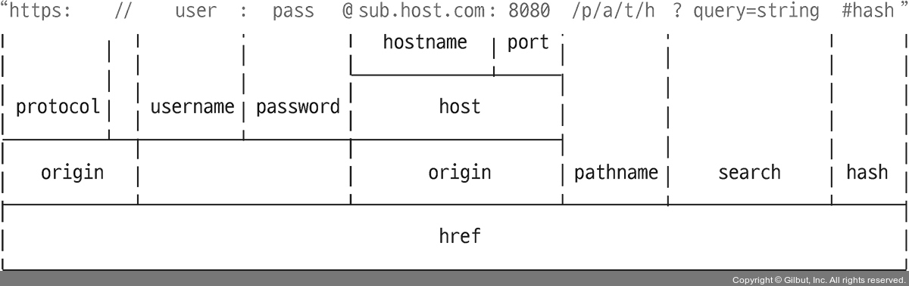

# Node.js

### 목표

: 서버 구축, 실시간 데이터 이동 구현, 인터넷 동작 원리, 보안 지식 습득

### 공부방법

: 인터넷 강의로 입문하고 공식 문서 보기

### 학습내용

<ul style="list-style: none">
  <li>
  <details>
  <summary>맛보기 내용</summary>

- 응답 반환 설정  
  `response.end();`  
  : if else 문에서 중복 생략하기 위해 아래에 두었더니 한 박자 늦은 값 출력

- 패키지매니저 - pm2

  `pm2 start main.js --watch` : 파일 수정하면 자동 갱신  
  `pm2 logs` : 실시간 로그 확인 (ctrl + c : 나가기)

- form method="post"  
  : 발신 내용을 숨겨서 전송, 주소창에 드러나지 않음

- node에서 파일 추출/내보내기  
  : module.exports, require

- 링크 이동  
  : `{Location: ...}` 설정할 때 한글 주소 인식 오류

- 삽입공격 방지  
   : `path.parse().base`, `sanitize-html API`
    </details>
    </li>

    <li>
    <details>
    <summary>노드 기본 기능</summary>

  - ### 환경변수

    `process.env` : 비밀키를 보관하는 용도

  - ### 노드 이벤트 루프 우선순위

    : `nextTick` -> `promise` -> `timeout` -> `immediate`

  - ### path

    : `\`, `/` 자동 처리

    ```javascript
    path.join(**dirname, '..', '/var.js');
    // C:\\user\\var.js (주소 결합 역할)
    path.resolve(**dirname, '..', /var.js);
    // C:\\var.js (절대경로 탐색)

    // 상대경로: 현재폴더에서 시작 / 절대경로: 루트폴더에서 시작
    ```

  - ### 노드 주소 체계

    : `new URL('주소')` -> URL 객체 값 반환

    

  - ### crypto

    1. **해쉬화**  
       : 암호화 O - 복호화 X, 알고리즘 다양

    2. **대칭형 암호화**  
       : key 사용됨 (서버 - 프론트 사용 불가: 프론트에서 key 드러남)

    3. **비대칭형 암호화**  
       : 서로 다른 key 사용 (서버 - 프론트 사용)

  - ### util
    : 각종 편의 기능 모듈  
    `deprecated`, `promisify` 자주 사용
    ```
    // deprecated
    // 변경될 코드 사용자에게 경고 알림, 예시) 라이브러리 관리
    ```
    ```
    // promisify
    // 프로미스 패턴화(async/await 가능)
    ```
  - ### worker_thread

    : 멀티스레드는 다른 언어 추천

  - ### child_process

    : 다른 언어 가져오기, `호출` 역할

    ```javascript
    const spawn = require("child_process");
    const process = spawn("python", ["test.py"]);

    process.stdout.on("data", function (data) {
      console.log(data.toString());
    });
    ```

  - ### 동기/비동기

    - **동기**
      - 순서대로 실행
      - 한번에 하나 처리
    - **비동기**
      - 순서대로 실행 X
      - 한번에 여러 개 처리  
        : `then`, `await` 사용하여 순서대로 처리 가능

  - ### 버퍼/스트림

    - **버퍼**  
      : 일정한 크기로 모아두는 데이터 - 일정 크기가 되면 한 번에 처리
    - **스트림**  
      : 데이터 흐름 - 일정한 크기로 나눠서 여러 번 처리 (대용량 처리 유리)

  - ### 에러 처리

    - 콜백 에러는 노드 프로세스를 멈추게 하지 않는다.
    - `promise` 사용할 때 `catch` 붙여야 한다.

      ```javascript
      process.on("uncaughtException", (err) => console.error(err));

      // 모든 에러 기록하지만 복구 작업 부적합
      ```

    </details>
    </li>

    <li>
    <details>
    <summary>Express</summary>

    - ## nodemon

      : 프로젝트 파일 변경 감지

      - 실행  
        : npx nodemon `<파일명>`

    - ## 문서

      ### 1. 기본 라우팅

      - app.`METHOD`( `PATH` , `HANDLER` )
        - `METHOOD`  
          : get post send put post delete : 소문자 작성
        - `PATH`  
          : 경로
        - `HANDLER`  
          : 경로 도착 시 실행되는 함수

      ### 2. set(키, 값)

      : 환경변수 지정

      - `get('키')` 값 불러오기 가능

      ### 3. HTML 읽기

      : `sendFile()`, 받은 경로 파일로 변환

      - path: 파일과 폴더 경로  
        `.join()`: 부여한 인수 순서대로 결합

      ### 4. 미들웨어요청

      : 응답 주기 중 접근 권한을 갖는 함수  
       `use()` = 미들웨어 X, 미들웨어 함수를 결합 O

      ```javascript
      app.use([path,] (req, res, next) => {});

      /*
        path: 지정한 경로에 적용
        req: 요청
        res: 반응
        next: 다음 라우터
      */

      // 에러 처리 (매개변수 4개)
      app.use([path,] (err, req, res, next) => {});
      ```

      ### 5. Express 주의사항

      - 한번의 요청은 하나의 반응을 반환.
      - `writeHead()`, `end()` 사용자제  
        : 편의를 위해 하나로 만든 `send()` 사용 권장

        </details>
        </li>
      </ul>

<details>
<summary>의문점</summary>

- #### fs 함수 중첩

  : 콜백지옥 되는 거 아닌 가?

- #### 파일 추출/내보내기

  : es6/node `import`, `require` 차이점

- #### 에러처리, status처리는 서로 다른 건가?

  ```
  에러처리는 매개변수를 4개를 갖는 미들웨어
  status처리는 path를 가지고 있지 않는 라우터
  ```

</details>

### 톺아보기

- [fs 함수 중첩 - 콜백지옥 되는 거 아닌 가?](./md/fsCallbackHell.md)
- [파일 추출/내보내기 - ESM, CommonJS 차이점](./md/importExportDiff.md)
- [Method="post" - 어떻게 전송되는 가?](./md/method_post.md)
- [삽입공격 - 어떻게 막아야 할까?](./md/injectionAtt.md)

### 예제

[예제 1 - CRUD 구현(리팩토링)](./createNewServer/main.js)
