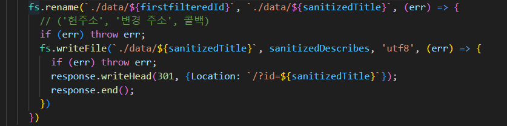

# Callback hell in Node.js

## 의문점

<p align="center">
  
</p>

<p align="center" >
fs가 중첩되는 구조가 자바스크립트 콜백지옥과 유사함을 느낌
<br/>
node.js에서 어떻게 해결하는지 찾아봄
</p>

## 참고자료

[Node.js의 비동기 처리 방식과 콜백 지옥 탈출하기 - 예술하는 개발자 최씨](https://artdeveloper.tistory.com/8)  
[What is callback hell in Node.js ? - geeksforgeeks](https://www.geeksforgeeks.org/what-is-callback-hell-in-node-js/)  
[How to Avoid Callback Hell in Node.js ? - geeksforgeeks](https://www.geeksforgeeks.org/how-to-avoid-callback-hell-in-node-js/)

## 정리내용

### 1. Node.js 란?

: `Node.js`는 자바스크립트의 또 다른 런타임 환경이다. 브라우저에서 자바스크립트가 작동했다면 `Node.js`는 외부에서도 실행될 수 있도록 해준다.

### 2. 콜백지옥이란 무엇인가?

: 자바스크립트의 비동기 처리에서 함수가 중복되어 코드 가독성이 낮아지는 상황이다. 자바스크립트 기반 `Node.js`에서도 똑같은 상황이 연출될 수 있다.

### 3. Node.js 콜백지옥 해결방법

: 자바스크립트 콜백지옥 해결방법과 똑같다.

1. Promise
2. async / await
3. require( ' fs/promises ' )

세 가지 방법 중 하나를 선택하여 코드에 적용한다.  
1, 2번은 프로미스를 반환하도록 함수를 선언해야 된다.

```javascript
function fsRename(firstfilteredId, sanitizedTitle) {
  return new Promise((res, rej) => {
    fs.rename(`./data/${firstfilteredId}`, `./data/${sanitizedTitle}`, (err) => {
      if (err) return rej(err);
      return res();
    });
  });
}

function fsWriteFile(sanitizedTitle, sanitizedDescribes, response) {
  return new Promise((res, rej) => {
    fs.writeFile(`./data/${sanitizedTitle}`, sanitizedDescribes, "utf8", (err) => {
      if (err) return rej(err);
      response.writeHead(301, { Location: `/?id=${sanitizedTitle}` });
      response.end();
      return res();
    });
  });
}
```

1. `Promise` 체이닝 적용

```javascript
fsRename(firstfilteredId, sanitizedTitle)
  .then((res) => {
    return fsWriteFile(sanitizedTitle, sanitizedDescribes, response);
  })
  .catch((err) => {
    console.error(err);
  });
```

3. `require('fs/promise')` 불러오기

```javascript
(async () => {
  try {
    const fsRenameFn = await fsPromises.rename(
      `./data/${firstfilteredId}`,
      `./data/${sanitizedTitle}`
    );
    const fsWriteFileFn = await fsWriteFile(
      sanitizedTitle,
      sanitizedDescribes,
      response
    );
  } catch (err) {
    console.error(err);
  }
})();
```

## 결론

<p align=center>
Promise 반환, async/await 적용, Node에서 제공하는  
<br>
Promise 함수로 콜백지옥을 해결할 수 있다.  
<br/>
전과 달라진 점은 가독성이 높아지고 에러처리 하기 수월해졌다.
</p>
