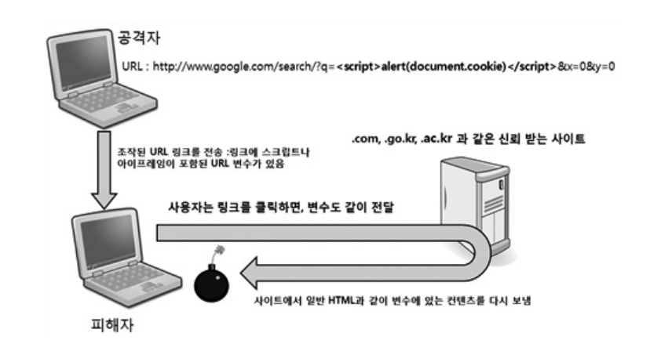
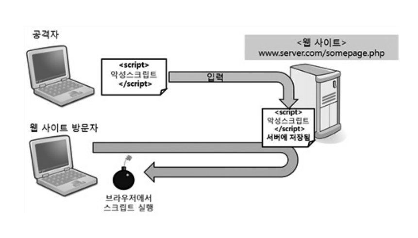

# The way to protect data from XSS

## 의문점

<p align="center" >
input 태그로 데이터를 받을 수 있구나~
<br/>
근데 자바스크립트도 받을 수 있네?
<br/>
어떻게 코드를 작성해야 할까..?
</p>

## 참고자료

[크로스사이트스크립팅(XSS) 공격종류 및 대응방법 - 한국인터넷진흥원](https://www.kisa.or.kr/20302/form?postSeq=105&lang_type=KO#fnPostAttachDownload)  
[크로스 사이트 스크립팅의 정의 및 공격 유형 - NordVPN](https://nordvpn.com/ko/blog/xss-attack/)  
[XSS 공격을 직접 해보면서 알아보기 - 민동준](https://dj-min43.medium.com/xss-%EA%B3%B5%EA%B2%A9%EC%9D%84-%EC%A7%81%EC%A0%91-%ED%95%B4%EB%B3%B4%EB%A9%B4%EC%84%9C-%EC%95%8C%EC%95%84%EB%B3%B4%EA%B8%B0-c2c1d9baf7ec)

## 정리내용

### 1. XSS는 무엇인가?

- ### 정의

  : Cross-Site Scripting,  
   웹사이트에 악성 스크립트를 삽입하는 행위다. 사용자가 웹 페이지를 방문할 때 브라우저에서 악성 스크립트가 실행되도록 만들어 사용자의 정보를 탈취하거나, 웹 사이트의 기능을 변경하거나, 피싱 공격을 수행할 수 있다.

- ### XSS 종류

  1. #### 반사형 XSS

     : 가장 일반적인 XSS 공격, 사용자에게 입력 받은 값을 서버에 되돌려주는 곳에서 발생한다.  
     주로 이메일 링크나 URL에 악성 스크립트를 포함시켜 피해자가 이를 클릭하게 유도한다.  
     

  2. #### 영구적 XSS

     : 악성 스크립트를 서버에 삽입해놓는 공격으로 저장형 XSS 공격이라고도 한다.  
     사용자들이 해당 페이지를 방문할 때마다 실행되는 공격이다.  
     

  3. #### DOM XSS
     : 서버와의 통신 없이 DOM(Document Object Model)을 통해 발생하는 XSS 공격이다.  
      DOM 기반 XSS는 웹사이트의 코드를 조사하지 않고는 취약점을 발견하기 어렵다.  
      

- ### 공격의 피해

  - #### 쿠키 정보/세션 ID 획득

    > 쿠키란 브라우저에게 보내는 4KB 이하의 작은 텍스트 파일이다.  
    > 사용자가 브라우저를 클릭할 때마다 웹 서버로 사용자 정보가 담긴 쿠키를 전달한다.

  - #### 시스템 관리자 권한 획득

    > 조직 PC가 해킹되는 경우, 조직의 내부 시스템으로 이동하여 내부의 중요 정보를 탈취하는 공격으로 이어질 수 있다.

  - #### 악성코드 다운로드

### 2. XSS를 막는 방법?

- #### 입・출력 값 검증 및 무효화

  : 사용자가 입력한 모든 데이터를 검증, 지정한 형식만 받는다.

  ```
  <div style="background-image: url(javascript:alert(document.cookie))">

  > HTML ->  ASCII 문자 변환
  > CSS 속성 값도 ASCII 변환 (색상: 16진수 변환)
  ```

- #### 보안 라이브러리 사용
- #### (사용자) 브라우저 확장 프로그램 사용

## 결론

<p align=center>
XSS 공격이 10대 웹 애플리케이션의 취약점 2021년 기준 3 순위였다.
<br>
무시할 수 없는 취약점이었다.
<br>
보안을 위해 HTTP, 서버를 공부를 해야겠다.
</p>
